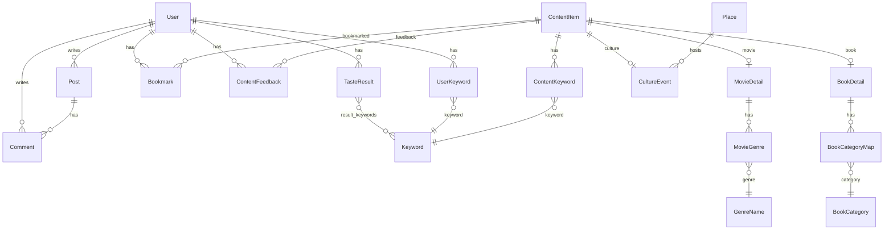

# GotYA Frontend README

GotYA는 사용자의 문화 취향을 테스트하고, 그 결과를 바탕으로 영화, 도서, 문화생활 콘텐츠를 추천하는 문화 취향 큐레이션 서비스입니다.  
이 README는 `@희연`, `@유림` 인수인계서와 현재 대화창에서 진행한 프론트엔드 고도화 작업을 합쳐 작성한 프론트엔드 중심 최종 문서입니다.

---

## A. 팀원 정보 및 업무 분담

| 담당 | 주요 업무 |
| --- | --- |
| 희연 | 회원가입/로그인, 마이페이지, 프로필 수정, 취향 테스트, AI 추천 화면, 좋아요/싫어요, 커뮤니티, 알라딘 API 수집, 추천/마이페이지 UI 상태 정리 |
| 유림 | DB 모델링, 영화/도서/문화 데이터 정제 및 적재, 콘텐츠 조회 API, TourAPI 문화 데이터 보강, 전국 문화지도, 문화지도 API 연동 |
| 프론트엔드 최종 통합 | 메인 배너, 취향 테스트 시작/질문/결과 UI, 라운지 UI, 커뮤니티/마이페이지 배경, 로고/폰트, 반응형 안정화, 라운지 상단 이동 버튼, README 정리 |

---

## B. 목표 서비스 및 실제 구현 정도

### 목표 서비스

GotYA는 “오늘 뭐 하지?”라는 고민을 문화 취향 기반으로 해결하기 위한 서비스입니다.

- 사용자는 13문항의 취향 테스트를 진행한다.
- 테스트 결과로 6가지 문화 취향 유형 중 하나를 받는다.
- 취향 결과와 사용자 반응 데이터를 바탕으로 영화, 도서, 문화생활 콘텐츠를 추천받는다.
- 콘텐츠 라운지에서 영화/도서/문화생활을 탐색한다.
- 문화지도에서 지역별 공연, 전시, 축제 정보를 확인한다.
- 커뮤니티에서 추천, 후기, 질문, 자유글을 작성한다.
- 마이페이지에서 찜 목록과 다시 보고 싶지 않은 콘텐츠를 관리한다.

### 실제 구현 정도

| 영역 | 구현 상태 |
| --- | --- |
| Vue 3 프론트엔드 앱 | 완료 |
| 라우팅 및 인증 가드 | 완료 |
| 회원가입/로그인/로그아웃 | 완료 |
| 마이페이지/프로필 수정 | 완료 |
| 취향 테스트 시작/질문/결과 흐름 | 완료 |
| AI 추천 페이지 | 완료 |
| 영화/도서/문화생활 라운지 | 완료 |
| 무한 스크롤 | 완료 |
| 라운지 상단 이동 버튼 | 완료 |
| 콘텐츠 상세 모달 | 완료 |
| 좋아요/싫어요/찜 연동 | 완료 |
| 커뮤니티 CRUD 및 댓글 | 완료 |
| 전국 문화지도 | 완료 |
| 전체 UI 리디자인 | 완료 |
| 반응형 보정 | 진행 완료, 추가 실기기 확인 권장 |
| 배포 URL | 미배포 |

---

## C. 데이터베이스 모델링 ERD

ERD 원본 이미지는 [`@참고자료/ERD_image_v2.png`](./@참고자료/ERD_image_v2.png)에 있습니다.

### 핵심 모델 구조



### 모델링 특징

- `User`는 `login_id` 기반 커스텀 유저 모델이다.
- 영화, 도서, 문화생활은 공통 부모 성격의 `ContentItem`으로 묶고, 상세 정보는 `MovieDetail`, `BookDetail`, `CultureEvent`로 분리했다.
- 추천, 찜, 좋아요, 싫어요는 콘텐츠 종류와 무관하게 `ContentItem`을 기준으로 동작한다.
- `Keyword`, `ContentKeyword`, `UserKeyword`를 통해 콘텐츠 키워드와 사용자 취향 키워드를 연결한다.
- 취향 테스트 설정은 `TasteTypeDefinition`, `TasteQuestion`, `TasteScoreRule`, `TasteTestConfig`로 관리한다.
- 커뮤니티는 `Post`, `Comment` 중심으로 구성되며 작성자 권한에 따라 수정/삭제가 제한된다.

---

## D. 추천 알고리즘 기술 설명

### 전체 흐름

```text
취향 테스트 응답
-> 질문별 점수 규칙 적용
-> 6개 취향 유형 점수 계산
-> 대표 취향 유형 결정
-> 사용자 키워드 생성
-> DB 후보 콘텐츠 추출
-> GMS/Gemini 기반 순위 보정
-> 영화/도서/문화생활 추천 결과 표시
-> 좋아요/싫어요/찜 피드백 반영
```

### 취향 테스트 계산

- 프론트에서는 `TasteTestQuestionView.vue`가 질문을 순서대로 표시한다.
- 선택지는 A/B 구조이며 내부 값은 boolean으로 API에 전달된다.
- 응답은 Pinia `tasteTest` store와 `sessionStorage`에 임시 저장되어 새로고침에도 유지된다.
- 제출 시 `/api/tastes/test/results/`로 모든 문항의 답변을 전송한다.
- 백엔드는 `TasteScoreRule`을 기준으로 유형별 점수를 누적한다.
- 가장 높은 점수의 유형을 대표 유형으로 선택하고, 동점이면 정책상 우선순위와 대표 문항 기준을 활용한다.
- 결과에는 대표 유형, 키워드, 설명, 축별 점수, 추천 가이드가 포함된다.

### 추천 후보 선정

- 추천 후보는 서비스 DB에 존재하는 콘텐츠만 사용한다.
- 영화는 TMDB 장르/인기도/평점/개봉일 정보를 활용한다.
- 도서는 알라딘 카테고리/판매지수/리뷰점수/출간일 정보를 활용한다.
- 문화생활은 문화행사 대분류/소분류/지역/기간 정보를 활용한다.
- 성인 콘텐츠, 중복 콘텐츠, 사용자가 싫어요 처리한 콘텐츠는 후보에서 제외한다.

### AI 추천 보정

- 프론트는 먼저 `/api/tastes/recommendations/preview/`를 호출해 DB 기반 추천을 즉시 표시한다.
- 이후 `/api/tastes/recommendations/generate/`를 호출해 GMS/Gemini 기반 추천 순위 보정을 시도한다.
- AI 호출이 실패해도 DB 추천 결과는 유지되어 사용자의 화면 흐름이 끊기지 않는다.
- AI는 DB 후보 ID 범위 안에서만 순위를 조정하므로, 실제 DB에 없는 콘텐츠가 화면에 나타나지 않는다.

---

## E. 핵심 기능 설명

### 1. 인증과 공통 API

관련 파일:

- `frontend/src/api/index.js`
- `frontend/src/stores/auth.js`
- `frontend/src/router/index.js`
- `frontend/src/components/AppHeader.vue`

구현 내용:

- Axios 인스턴스의 `baseURL`을 `/api`로 통일했다.
- 로그인 토큰은 `localStorage`의 `todayWhatAuthToken`에 저장한다.
- 요청 인터셉터에서 `Authorization: Token ...` 헤더를 자동으로 붙인다.
- 401 응답이 오면 토큰을 제거하고 전역 `auth:unauthorized` 이벤트로 인증 상태를 초기화한다.
- 라우터에서는 `requiresAuth`, `guestOnly` meta를 사용해 마이페이지/글쓰기/프로필 수정 접근을 제어한다.

학습한 점:

- 프론트에서 인증 상태는 단순히 토큰 유무만으로 판단하면 안 되고, 현재 사용자 정보와 함께 관리해야 안정적이다.
- API 에러 처리는 각 화면에 흩어두기보다 store에서 공통 메시지로 정리하는 것이 유지보수에 좋다.

어려웠던 점:

- 로그아웃, 토큰 만료, 새로고침 상황에서 화면과 store 상태가 엇갈릴 수 있었다.
- 이를 `initializeAuth()`와 응답 인터셉터로 정리했다.

### 2. 메인 화면

관련 파일:

- `frontend/src/views/HomeView.vue`
- `frontend/src/assets/images/home-hero/main-background.png`
- `frontend/src/assets/images/home-hero/gotya-machine.png`

구현 내용:

- 메인 배너를 가챠 감성의 파스텔 배경과 3D 머신 이미지로 리디자인했다.
- 기존 로고는 `logo.png`로 교체하고 크기를 키웠다.
- A2Z 폰트 기반으로 큰 타이포그래피를 구성했다.
- 추천 콘텐츠 카드, 오늘의 PICK, 상세 모달, 좋아요/싫어요/찜 흐름과 연결했다.
- 확대/축소 시 배경이 따로 움직이지 않도록 데스크톱 구간의 배경 기준 크기를 조정했다.

학습한 점:

- 큰 배너는 `100vw`, `cover`, `vw` 기반 폰트가 섞이면 브라우저 확대/축소에서 쉽게 흔들린다.
- 장식 이미지는 `max-width`, `background-size`, 미디어쿼리 기준을 분리해야 안정적이다.

어려웠던 점:

- 모니터 크기에 따라 자연스럽게 맞춰야 하지만, 브라우저 zoom에서는 고정된 것처럼 보여야 했다.
- 완전히 분리할 수는 없지만 데스크톱 기준 배경 캔버스를 안정화하여 흔들림을 줄였다.

### 3. 취향 테스트 시작 화면

관련 파일:

- `frontend/src/views/TasteTestStartView.vue`
- `frontend/src/assets/taste-test.css`
- `frontend/src/assets/images/taste-test-background.png`
- `frontend/src/assets/images/taste-gotya-machine.png`

구현 내용:

- 로그인 사용자가 이전 결과가 있으면 “이전에 뽑은 나의 문화 취향” 카드가 먼저 보인다.
- “다시 테스트하기”를 누르면 바로 1번 질문으로 이동하지 않고 시작 메인 화면으로 돌아가도록 수정했다.
- 시작 화면은 `background.png`, `gotYA_machine_투명배경.png` 계열 이미지를 복사해 사용했다.
- Start 버튼 위치가 화면 높이에 따라 자유롭게 움직이지 않도록 데스크톱 기준 위치를 고정했다.
- 이전 결과 카드의 왼쪽 머신 이미지, 우측 취향 구성 카드, 다시 테스트 버튼 위치를 예시 이미지에 맞춰 조정했다.

학습한 점:

- “다시 테스트하기”는 데이터 초기화만으로 충분하지 않고, 사용자가 기대하는 라우팅 시작점도 중요하다.
- 결과가 있는 시작 화면과 신규 시작 화면은 같은 route를 쓰더라도 UI 상태가 다르므로 query와 store 상태를 함께 고려해야 했다.

어려웠던 점:

- 배경 이미지, 머신 이미지, 버튼이 모두 absolute 성격을 띠어 화면 크기별 위치가 계속 어긋났다.
- 데스크톱 기준과 모바일 기준을 분리해 안정화했다.

### 4. 취향 테스트 질문 화면

관련 파일:

- `frontend/src/views/TasteTestQuestionView.vue`
- `frontend/src/assets/taste-test.css`
- `frontend/src/assets/images/taste-question-emojis/*`
- `frontend/src/assets/images/taste-progress-capsules/*`

구현 내용:

- 기존 질문 진행 로직, 선택 로직, 제출 로직은 유지하고 UI만 가챠 감성으로 리디자인했다.
- 질문 카드는 큰 흰색 카드로 고정하고, 내부에 capsule 번호, 질문 제목, 보조 문구, 답변 카드를 배치했다.
- 답변 선택지는 A/B 텍스트 버튼에서 “이모지 이미지 + 답변 문장” 카드형 UI로 변경했다.
- 답변 카드의 A/B 라벨은 최종적으로 제거했다.
- 1-A부터 13-B까지 질문별 이모지 이미지를 매핑했다.
- 체크무늬 배경처럼 보이는 이모지 이미지는 CSS에서 흰 배경과 그림자 처리로 어색함을 줄였다.
- 상단 진행 UI는 집게를 제거하고 닫힌 캡슐/열린 캡슐 이미지로 변경했다.
- 현재 질문은 열린 캡슐, 이후 질문은 닫힌 캡슐로 표시되도록 했다.
- 질문/답변 줄바꿈은 JSON의 줄바꿈과 UI 렌더링 방식을 맞춰 가독성을 개선했다.
- 질문 1, 9, 13처럼 줄바꿈이 필요한 문장은 중앙 정렬로 표시하고, 나머지는 가능한 한 한 줄로 유지했다.

학습한 점:

- 데이터 원문에서 줄바꿈을 관리하려면 UI가 `\n`을 실제 줄로 렌더링하도록 만들어야 한다.
- 자동 줄바꿈 로직은 문장마다 예측하기 어려워, 기획 의도가 있는 문장은 데이터 기반 줄바꿈이 더 명확했다.
- 이미지 기반 진행 UI는 각 단계의 크기가 조금만 달라도 전체 라인이 흔들려 보여서 이미지 크기와 여백을 강제로 맞춰야 했다.

어려웠던 점:

- 질문 카드 크기가 질문 길이에 따라 바뀌어 화면이 들썩였다.
- 카드 높이와 답변 영역 기준을 고정해 질문 전환 시 레이아웃 변화를 줄였다.
- 긴 질문을 한 줄로 유지하면서도 카드 중앙에 배치하는 균형을 맞추는 것이 가장 까다로웠다.

### 5. 추천 결과 화면

관련 파일:

- `frontend/src/views/RecommendationView.vue`
- `frontend/src/assets/recommendations.css`
- `frontend/src/assets/images/taste-result/*`

구현 내용:

- 테스트 결과 화면을 예시 이미지 기반으로 리디자인했다.
- 상단에 “오늘의 도파민, AI가 한 번 더 뽑아드려요.” 배너를 구성했다.
- 결과 카드에는 취향 이름, 설명, 키워드, 취향 구성도를 표시한다.
- 취향 구성도는 퍼센트 대신 10점 만점 점수 형태로 표시하도록 수정했다.
- 아래쪽 설명 카드들은 제거하고, “다시 테스트하기” 버튼 하나로 정리했다.
- 결과 배경은 테스트결과 배경 이미지를 복사해 적용했다.

학습한 점:

- 결과 화면은 정보가 많아질수록 추천 화면과 경쟁한다.
- 핵심 결과와 다시 테스트 CTA만 남기면 사용자 흐름이 더 명확해진다.

어려웠던 점:

- 취향 구성도 텍스트가 길어 카드 안에서 줄바꿈되어 보기 나빴다.
- 퍼센트 표기 대신 10점 만점 숫자로 줄여 카드 내부 밀도를 낮췄다.

### 6. 영화/도서/문화생활 라운지

관련 파일:

- `frontend/src/views/ContentListView.vue`
- `frontend/src/stores/contents.js`
- `frontend/src/assets/contents.css`

구현 내용:

- `/movies`, `/books`, `/cultures`가 하나의 `ContentListView.vue`를 공유하도록 구성했다.
- 콘텐츠 종류별 endpoint, 필터, 정렬, 상세 조회를 분기한다.
- 영화/도서는 인기 순위 영역을 제공한다.
- 문화생활은 문화지도 미리보기와 지역별 행사 흐름을 연결한다.
- 무한 스크롤을 `IntersectionObserver` 기반으로 구현했다.
- 라운지 하단에는 위로 이동 버튼을 추가했다.
- 버튼은 영화/도서/문화생활 라운지에만 적용되며, 누르면 무한 스크롤 시작 지점으로 이동한다.
- 라운지 배경은 `loung_background.png` 계열 이미지를 복사해 사용했다.

학습한 점:

- 같은 레이아웃을 세 종류의 콘텐츠가 공유하려면 store와 view 모두 contentType 기준 분기가 명확해야 한다.
- 무한 스크롤은 데이터 append, page 상태, loading 상태가 조금만 꼬여도 중복 요청이 발생한다.

어려웠던 점:

- 상단 이동 버튼을 fixed로 둘지, 리스트 영역 안에 둘지 UX가 애매했다.
- 최종적으로 사용자가 많이 내려간 상태에서도 접근 가능한 위치에 두되, 라운지 페이지에만 노출되도록 제한했다.

### 7. 전국 문화지도

관련 파일:

- `frontend/src/components/CultureMap.vue`
- `frontend/src/views/CultureMapView.vue`
- `frontend/src/utils/loadKakaoMap.js`
- `frontend/src/assets/culture-map.css`

구현 내용:

- 카카오 지도 SDK를 로드하고 전국 시도 중심 오버레이를 표시한다.
- 지역을 선택하면 해당 지역의 문화행사를 불러온다.
- 공연, 전시, 축제/행사 카테고리 필터를 제공한다.
- 장소 좌표가 없을 경우 주소 검색 서비스를 통해 임시 좌표를 얻는다.
- 마커와 오른쪽 목록을 연결해 선택한 행사를 강조한다.

학습한 점:

- 외부 지도 SDK는 script 로딩 타이밍과 `kakao.maps.load()` 순서가 중요하다.
- 좌표가 없는 데이터는 지도에서 바로 사용할 수 없으므로 주소 검색 fallback이 필요하다.

어려웠던 점:

- 지도와 리스트가 서로 상태를 공유하므로 선택 상태를 컴포넌트 내부와 상위 view 사이에서 명확히 나눠야 했다.

### 8. 커뮤니티

관련 파일:

- `frontend/src/views/CommunityListView.vue`
- `frontend/src/views/CommunityDetailView.vue`
- `frontend/src/views/CommunityFormView.vue`
- `frontend/src/stores/community.js`
- `frontend/src/assets/community.css`

구현 내용:

- 게시글 목록, 상세, 작성, 수정, 삭제를 구현했다.
- 카테고리는 추천, 후기, 질문, 자유로 구분한다.
- 제목/본문 검색과 카테고리 필터를 제공한다.
- 댓글 작성, 수정, 삭제를 지원한다.
- 작성자 여부에 따라 수정/삭제 버튼을 조건부 표시한다.
- 커뮤니티 배경을 라운지 배경 이미지와 통일했다.

학습한 점:

- `is_owner` 같은 서버 계산 값을 프론트에서 받으면 권한 UI 처리가 훨씬 단순해진다.
- 목록 조회와 상세 조회의 응답 형태를 분리하면 불필요한 댓글 데이터를 줄일 수 있다.

어려웠던 점:

- 비로그인 사용자는 조회 가능하지만 작성은 막아야 하므로 라우터 가드와 버튼 상태를 함께 고려해야 했다.

### 9. 마이페이지

관련 파일:

- `frontend/src/views/MyPageView.vue`
- `frontend/src/views/ProfileEditView.vue`
- `frontend/src/stores/mypage.js`
- `frontend/src/assets/mypage.css`

구현 내용:

- 사용자 프로필, 닉네임, 프로필 이미지 수정 기능을 제공한다.
- 찜 목록과 싫어요 목록을 탭으로 전환한다.
- 전체/영화/도서/문화생활 필터를 제공한다.
- 목록은 무한 스크롤로 추가 로드한다.
- 마이페이지 배경을 라운지 배경 이미지로 통일했다.

학습한 점:

- 찜 목록과 싫어요 목록은 endpoint만 다르고 UI 구조가 비슷해서 하나의 collection store로 묶는 것이 효율적이다.

어려웠던 점:

- 기존 변수명이 bookmarks 중심이라 싫어요 목록과 함께 쓰기에는 의미가 애매했다.
- 기능 안정성을 우선해 구조는 유지하고 endpoint 선택 로직으로 확장했다.

### 10. 공통 UI/디자인 시스템

관련 파일:

- `frontend/src/assets/gotya-theme.css`
- `frontend/src/assets/auth.css`
- `frontend/src/assets/contents.css`
- `frontend/src/assets/taste-test.css`
- `frontend/src/assets/recommendations.css`
- `frontend/src/assets/community.css`
- `frontend/src/assets/mypage.css`

구현 내용:

- 전체 글씨체를 에이투지체로 통일했다.
- `logo.png`를 공통 헤더 로고로 적용하고 크기를 키웠다.
- 민트, 핑크, 보라, 하늘색 계열의 파스텔 가챠 무드를 유지했다.
- 메인, 취향 테스트, 추천 결과, 라운지, 커뮤니티, 마이페이지 배경을 통일감 있게 조정했다.
- 반응형 레이아웃에서 `100vw`로 인한 가로 스크롤을 줄이고 `width: 100%`, `max-width`, `clamp()`, `grid`, `auto-fit`을 활용했다.
- 데스크톱에서는 배경 기준을 안정화하고, 작은 화면에서는 기존 반응형 규칙이 동작하도록 조정했다.

학습한 점:

- 디자인 무드를 유지하면서 반응형을 잡는 일은 단순히 `max-width`만 넣는 것으로 끝나지 않는다.
- 배경, 장식 이미지, 텍스트, 버튼의 기준 좌표를 화면 크기별로 나눠야 한다.

어려웠던 점:

- 브라우저 확대/축소는 CSS 관점에서 viewport 변화처럼 동작하므로, “확대는 그대로, 축소는 같이 줄어듦”을 완벽히 분리하기 어렵다.
- 그래도 배경 크기 기준을 `max(100%, 1920px)` 형태로 조정해 혼자 밀리는 느낌을 줄였다.

---

## F. 생성형 AI 활용 부분

### 서비스 기능에서의 AI

- GMS/Gemini를 활용해 추천 후보의 순위를 보정한다.
- AI가 임의 콘텐츠를 생성하지 않도록, 백엔드가 먼저 DB 후보를 만들고 AI는 후보 ID 안에서만 선택한다.
- AI 실패 시 DB 기반 추천을 fallback으로 유지한다.

### 개발 과정에서의 AI

- 인수인계서 기반 코드 구조 파악
- Vue 컴포넌트 및 CSS 리팩터링 보조
- 취향 테스트 UI 리디자인
- 반응형 레이아웃 문제 분석
- README 문서화
- 질문/답변 문구 줄바꿈 정책 정리

느낀 점:

- 생성형 AI는 디자인 방향을 빠르게 실험하고 반복 수정하는 데 큰 도움이 되었다.
- 다만 이미지 위치, 줄바꿈, 반응형처럼 눈으로 확인해야 하는 작업은 사람이 기준을 명확히 잡아줘야 품질이 올라간다.

---

## G. 서비스 URL

현재 배포 URL은 없습니다.

로컬 실행:

```bash
cd frontend
npm install
npm run dev
```

백엔드 실행:

```bash
cd backend
python manage.py runserver
```

---

## H. 기타 기록하고 싶은 내용

### 프론트엔드 기술 스택

- Vue 3
- Vite
- Vue Router
- Pinia
- Axios
- CSS
- Kakao Map JavaScript SDK

### 주요 프론트엔드 파일 구조

```text
frontend/src
├─ api
│  └─ index.js
├─ assets
│  ├─ gotya-theme.css
│  ├─ auth.css
│  ├─ contents.css
│  ├─ culture-map.css
│  ├─ community.css
│  ├─ mypage.css
│  ├─ recommendations.css
│  ├─ taste-test.css
│  ├─ fonts
│  └─ images
├─ components
│  ├─ AppHeader.vue
│  └─ CultureMap.vue
├─ router
│  └─ index.js
├─ stores
│  ├─ auth.js
│  ├─ community.js
│  ├─ contents.js
│  ├─ mypage.js
│  ├─ recommendations.js
│  └─ tasteTest.js
└─ views
   ├─ HomeView.vue
   ├─ LoginView.vue
   ├─ SignupView.vue
   ├─ ContentListView.vue
   ├─ CultureMapView.vue
   ├─ TasteTestStartView.vue
   ├─ TasteTestQuestionView.vue
   ├─ RecommendationView.vue
   ├─ CommunityListView.vue
   ├─ CommunityDetailView.vue
   ├─ CommunityFormView.vue
   ├─ MyPageView.vue
   └─ ProfileEditView.vue
```

### 구현 과정에서 가장 크게 배운 것

1. 데이터 구조와 UI 구조는 같이 설계해야 한다.  
   취향 테스트 질문 줄바꿈처럼 단순한 화면 문제도 결국 JSON 데이터, Vue 렌더링, CSS가 함께 맞아야 해결된다.

2. 공통 컴포넌트는 초반에 어렵지만 후반에 강하다.  
   영화/도서/문화생활 라운지를 하나의 `ContentListView.vue`로 관리한 덕분에 무한 스크롤, 상세 모달, 상단 이동 버튼을 공통 적용할 수 있었다.

3. 반응형은 “줄어드는 것”만이 아니라 “덜 흔들리는 것”도 중요하다.  
   사용자는 화면 크기보다 시각적 안정성을 먼저 느낀다. 배경, 버튼, 카드가 각자 다른 기준으로 움직이면 완성도가 낮아 보인다.

4. AI 추천은 fallback 설계가 중요하다.  
   AI 응답을 기다리느라 화면이 멈추는 것보다, DB 추천을 먼저 보여주고 AI 보정이 오면 갱신하는 방식이 UX에 더 안정적이었다.

### 아쉬운 점과 개선 방향

- 모바일 실기기에서 전체 화면을 더 확인하면 좋다.
- 이미지 기반 UI가 많아져 asset 용량 최적화가 필요하다.
- 커뮤니티와 콘텐츠 상세의 접근성 라벨을 더 보강할 수 있다.
- 추천 결과 카드와 라운지 카드에 skeleton loading을 추가하면 체감 품질이 더 좋아질 수 있다.
- 마이페이지 store의 `bookmarks` 변수명은 추후 `items`처럼 더 일반적인 이름으로 정리하면 좋다.

### 프로젝트 소감

기능 구현뿐 아니라 UI의 완성도가 사용자 경험에 큰 영향을 준다는 것을 느꼈다.  
특히 반응형 레이아웃과 이미지 배치처럼 작은 디테일을 맞추는 과정이 생각보다 중요했다.  
백엔드 데이터와 프론트 화면이 자연스럽게 연결될 때 서비스가 훨씬 살아나는 느낌이었다.  
팀 프로젝트를 통해 기획, 디자인, 구현을 함께 맞춰가는 협업의 어려움과 재미를 배웠다.
